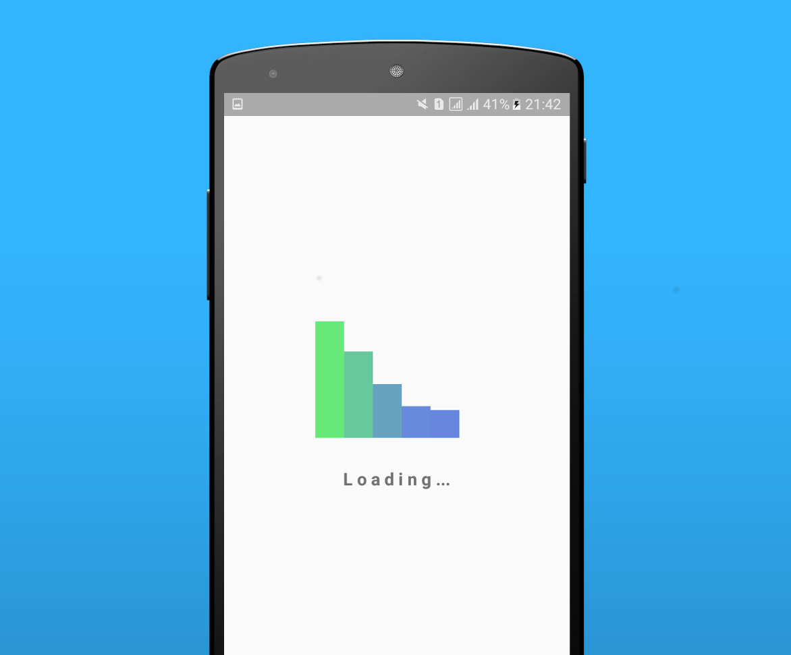
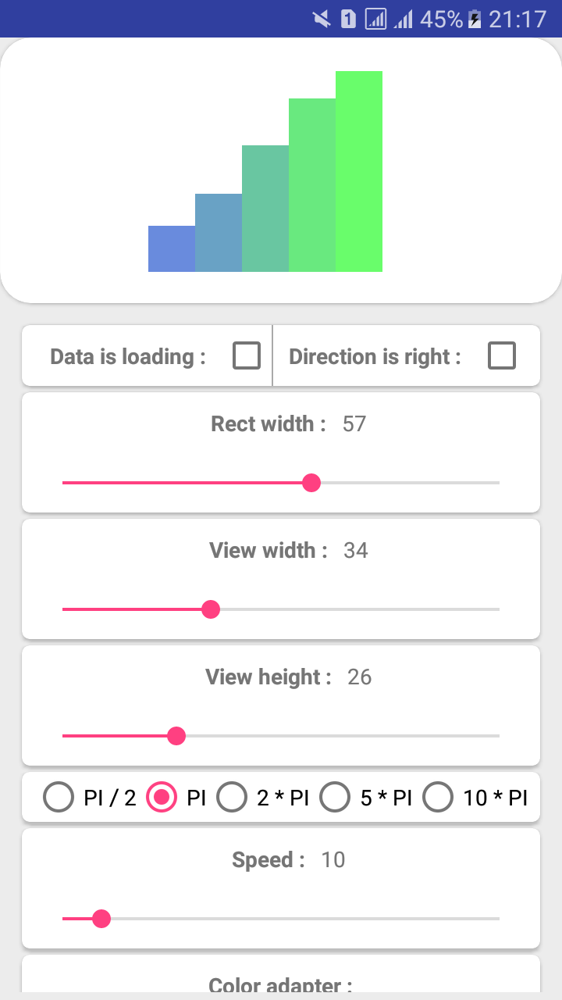
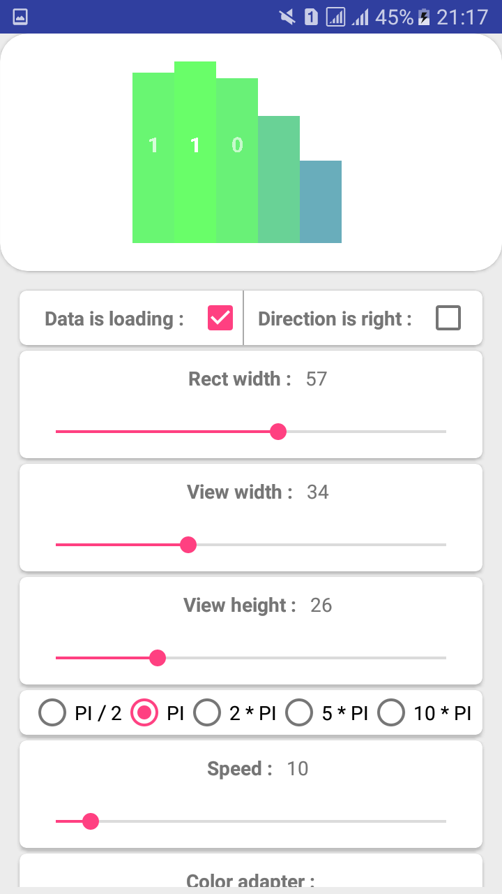
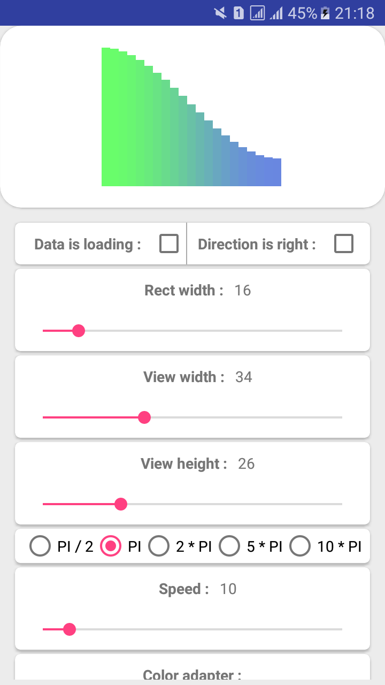
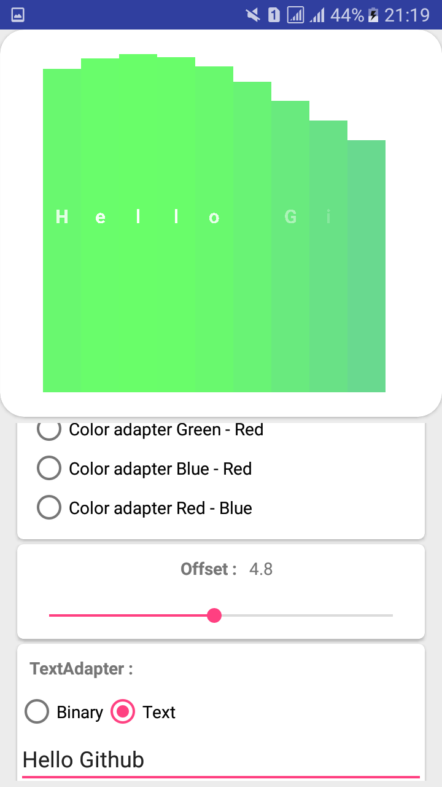
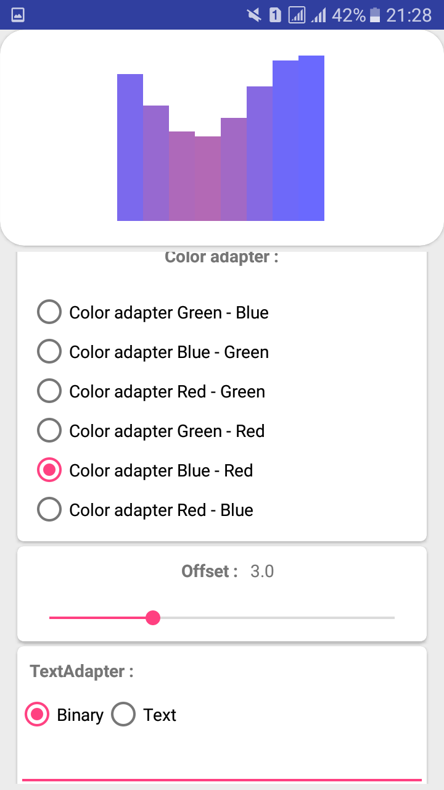
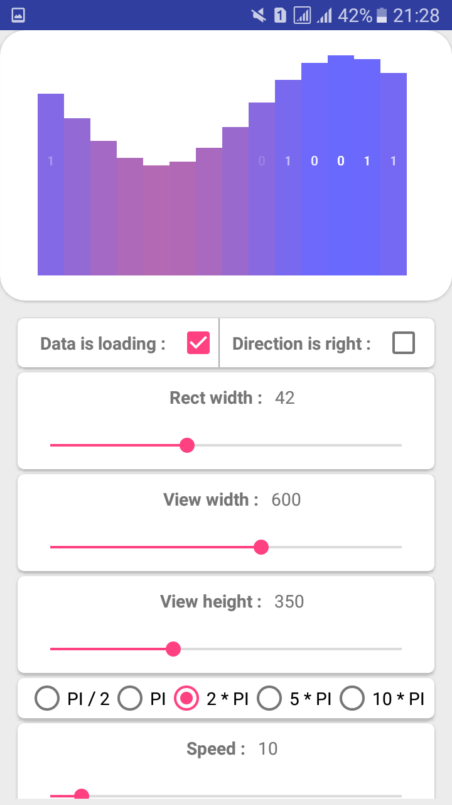
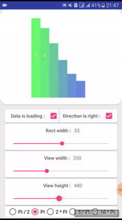
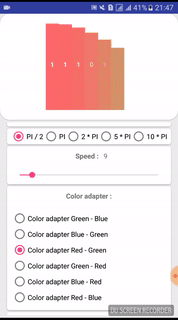
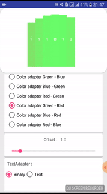

<p align="center">
	<h2 align="center""><b><font size="36">COSIN</font></b></h2>
	<h4 align="center">Loading android view lib</h4>
</p>


<p align="center"></p>

<p align="center">
	
	
	
</p>
<p align="center">
	
	
	
</p>

# Gradle :

build.gradle (Project)
```groovy
allprojects {
    repositories {
        ...
        maven { url 'https://jitpack.io' }
    }
}
```

build.gradle (Module)
```groovy
implementation 'com.github.NikitaGordia:Cosin:1.1.0'
```

# Quick start guide

## Declaration

```xml
<com.nikitagordia.cosin.Cosin
        android:layout_width="170dp"
        android:layout_height="140dp" />
```

## Properties

| Property    						    | Description   																					        |
| --------------------------------------|-----------------------------------------------------------------------------------------------------------|
| speed     							| Angle speed		  																						|
| isLoading    							| If 'true' shows symbols on rectangle		  																|
| setEnd    							| Shows end animation (optionally you may pass onEnd(OnEnd))
| rectWidth    							| Width each of rectangle 					  																|
| period    							| Determine period of cosinusoidal function																	|
| colorAdapter    						| Define color changes by two parameters (position count, height percent) for each rectagle					|
| offset    							| Moving bottom offset																						|
| directionRight    					| Determine movement side																					|
| textAdapter    						| Define text changes by position count for each rectangle													|

## There are 6 default ColorAdapter implementation in box :

* DefaultColorAdapterGB (Green -> Blue)
* ColorAdapterBG (Blue -> Green)
* ColorAdapterBR (Blue -> Red)
* ColorAdapterGR (Green -> Blue)
* ColorAdapterRB (Red -> Blue)
* ColorAdapterRG (Red -> Green)
* ColorAdapterBG (Blue -> Green)


## There are 2 default TextAdapter implementation in box :

* DefaultBinaryTextAdapter (shows random [0, 1] symbols in each rectagle)
* WordTextAdapter (shows specified cycle String)


#### ColorAdapter overriding example :
```java
public class ColorAdapterBR implements Cosin.ColorAdapter {

    @Override
    public int getBackgroundColor() {
        return Color.TRANSPARENT;
    }

    @Override
    public int calcColor(int numOfRect, double percentOfHeight) {
        return Color.argb(150, (int)(255 * (1d - percentOfHeight)), 0, (int)(255 * percentOfHeight));
    }
}
```

#### TextAdapter overriding example :
```java
public class WordTextAdapter implements Cosin.TextAdapter {

    private String word;

    public WordTextAdapter(String word) {
        this.word = word;
    }

    @Override
    public char getString(int numOfRect) {
        if (word.isEmpty()) return ' ';
        return word.charAt(numOfRect % word.length());
    }
}
```

#### A bit more gifs
<p align="center">
	
	
	
	
</p>